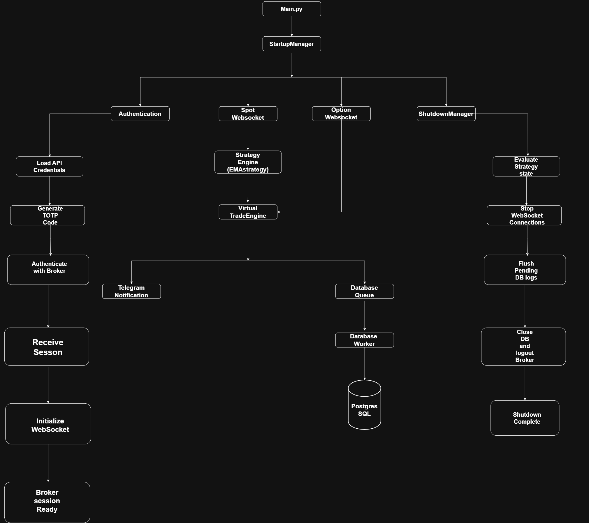
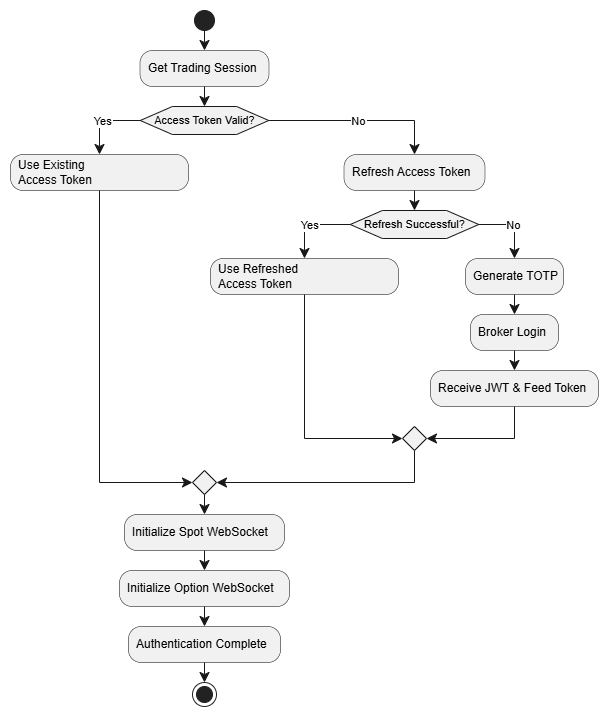
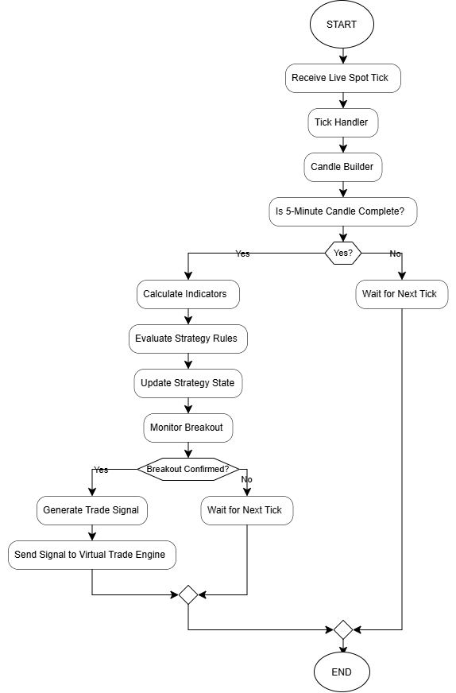
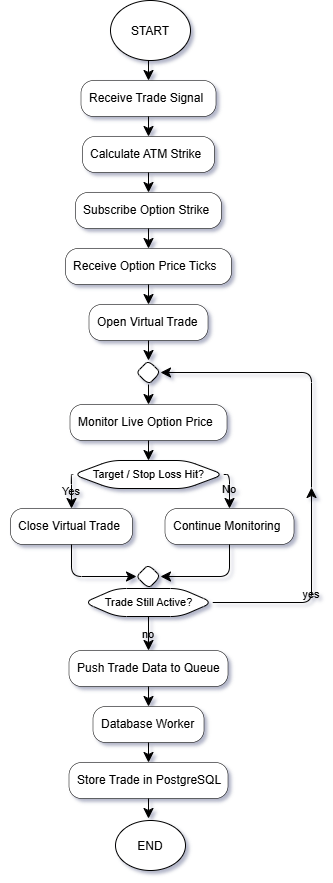

# EMA-10 Algorithmic Trading Bot

## Project Overview

This project is a Python-based algorithmic trading system built around a 10 EMA breakout strategy. It is designed to simulate the complete lifecycle of an automated trading system, from receiving live market data to generating trading signals, executing virtual trades, storing trade logs, sending real-time notifications, and performing graceful shutdown after market hours.

The system receives live market data through SmartAPI WebSockets, converts tick data into 5-minute candles, evaluates the trading strategy, manages trade execution using a state-driven architecture, and asynchronously stores execution logs in a relational database. The application is built using modular backend components that communicate with each other to provide a clean, maintainable, and scalable architecture.

## System Architecture

<!-- ________________________________Authentication_Flow_______________________________ -->

## Authentication

### Overview

The authentication module is responsible for establishing a secure session with the broker before any market data is received. It loads the broker credentials, generates a Time-based One-Time Password (TOTP), authenticates with SmartAPI, retrieves the required session tokens, and initializes the WebSocket connections for live market data.

Only after successful authentication does the system proceed with real-time data processing.

## Authentication Architecture

<!-- ________________________________Strategy_engine_Flow_______________________________ -->
## Strategy Engine

### Overview

The Strategy Engine is responsible for analyzing live market data and identifying trading opportunities based on predefined strategy rules. It receives real-time market ticks from the Spot WebSocket, converts them into 5-minute candles, calculates technical indicators, evaluates the strategy conditions, manages the strategy state, and monitors breakout confirmations. Once a valid trading signal is generated, it forwards the trade request to the Virtual Trade Engine for execution

## Strategy logic Architecture

## Components

### Tick Handler
Receives every live market tick from the Spot WebSocket and forwards it to the Candle Builder for processing.

### Candle Builder
Aggregates incoming tick data into 5-minute OHLC candles. Until a candle is completed, it continues updating the current candle with the latest market data.

### Indicator Calculation
Computes the technical indicators required by the trading strategy, such as the 10 EMA, using the completed candle data.

### Strategy Evaluation
Evaluates the completed candle against the predefined trading rules to determine whether a potential trade setup has formed.

### Strategy State Management
Maintains the current strategy state (for example, Idle, Trigger Armed, or In Trade) to ensure the strategy behaves correctly throughout the trade lifecycle.

### Breakout Detection
Continuously monitors live price movements after a setup is identified. When the breakout conditions are satisfied, it generates a valid trading signal.

### Virtual Trade Engine
Receives the validated trade signal and handles paper trade execution, trade logging, and notification processing.

## Virtual Trade Engine

### Overview

The Virtual Trade Engine is responsible for managing the complete lifecycle of a paper trade. Once a valid trade signal is received from the Strategy Engine, it dynamically subscribes to the selected option strike, continuously monitors its live price, evaluates stop-loss and target conditions, records the trade, and forwards the trade details to the asynchronous database logging system.

Unlike the Strategy Engine, the Virtual Trade Engine does not analyze market conditions. It only executes and manages trades based on the received trading signal.

## Virtual trading Architecture

## Components

Receive Trade Signal

Receives a validated BUY or SELL signal from the Strategy Engine along with the required trade parameters.

---

Calculate ATM Strike

Determines the appropriate option strike price based on the current underlying market price.

---

Subscribe Option Strike

Creates a live WebSocket subscription for the selected option contract to receive real-time price updates.

---

Open Virtual Trade

Creates a paper trade by recording the entry price, stop-loss, target, entry time, and other trade details.

---

Monitor Live Option Price

Continuously monitors the option price using live TBT data until either the stop-loss or target is reached.

---

Close Virtual Trade

Closes the virtual trade once the exit condition is satisfied and calculates the final trade result.

---

Push Trade Data to Queue

Instead of writing directly to the database, the completed trade is placed into a queue for asynchronous processing by the Database Worker.

---

Why a Queue?

The Virtual Trade Engine is responsible for real-time trade monitoring. Direct database writes could introduce unnecessary delays. By placing completed trades into a queue, the engine can immediately continue processing market data while a background worker handles database operations independently.

---

I think this is one of the strongest design decisions in your project. Introducing a queue between the Virtual Trade Engine and the database demonstrates an understanding of asynchronous processing and separation of responsibilities, which are concepts interviewers often look for in backend engineering projects.